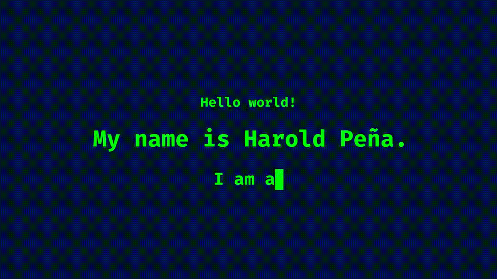

# @afrodynamic

> Find technologies that I have experience with below!

## Front-End

### Core

HTML5

|
CSS3

|
JavaScript

|
TypeScript

|
jQuery

### Frameworks

React

|
Redux

|
Next.js

|
Vue.js

|
Django

WordPress

|
Sanity

### CSS

Tailwind CSS

|
daisyUI

|
Material UI

|
Sass

|
Bulma

Vuetify

### Build / Dependency Management Tools

Parcel

|
Babel

|
Webpack

|
Vite

|
NPM

|
Yarn

Gradle

## Back-End

### OS

Arch

|
Ubuntu

|
Fedora

### General

GraphQL

|
Firebase

|
Flask

|
Socket.IO

### Server

Node.js

|
Express

|
PHP

|
Nginx

### Databases

MongoDB

|
PostgreSQL

|
SQLite

|
MySQL

|
MariaDB

Redis

|
Prisma

|
Sequelize

## General Programming / Technologies

Python

|
C

|
C++

|
Arduino

|
C#

|
Java

Lua

Processing

|
Raspberry Pi

## Containerization

Docker

|
Kubernetes

## Data Science & Visualization / Monitoring

NumPy

|
Pandas

|
Plotly

|
Jupyter

|
Grafana

Prometheus

## Testing

Jest

|
Selenium

|
Cypress

|
Mocha

|
Chai

Pytest

## Developer Tools

Git

|
Emacs

|
Vim

|
VS Code

|
ESLint

|
Markdown

## Deployment

Amazon AWS

|
Google Cloud Platform

|
DigitalOcean

|
Heroku

Linode

## Game Development

Unity

